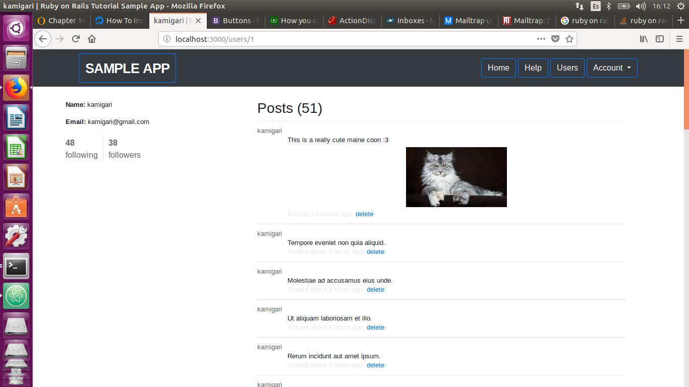

# Ruby on rails practice
This is a practice done by following the book [Ruby on Rails Tutorial (Rails 5) - Learn Web Development with Rails - Michael Hartl](https://www.railstutorial.org/book)

## Knowledge acquired

* How a Ruby on rails project works on its whole.

* How a controller can restrict the use of the actions the user can do on the application.

* How a mailer works with smtp and its implementation on the project.

* How a uploader works for the project and the requirements needed for its use.

* Tests can interact with the whole project: controllers, views, and models. The use of fixtures to simplify code.

* Helpers can mitigate code load from the controllers if needed.

* The models can validate and restrict their own usage. Also the relations we can have between them, even virtual relationships.

* How the ORM can be useful for the project and keep the code simple.

* Rendering the views from the action we display. Also how we can create some isolated views to render in a whole html document.

* The use of the routes restrictions and the resources involving the application needed.

* Migration use for the creation/update of the models in the database.

* Installation of the gems needed for the project to work.

* Discovery of mailtrap.io a really good tool for mail testing.

* This are just some important facts this book covers in all its 14 chapters.

## Prerequisites

To run this project you need to have installed Ruby on rails. I had the 5.2 version.

## Built within

* Ruby on rails

## Images from the project

* Home page when logged in:

* Profile page when logged in:

* Settings of the user when logged in:

* Display of all users:

## Authors

* **Michael Hartl** - *initial work* - [mhartl](https://github.com/mhartl)
* **Alberto Revuelta Arribas** - *continued work* [kamigari](https://github.com/kamigari)

## License

This project is lecensed under the License - see the [LICENSE.md](LICENSE.md) file for details.
